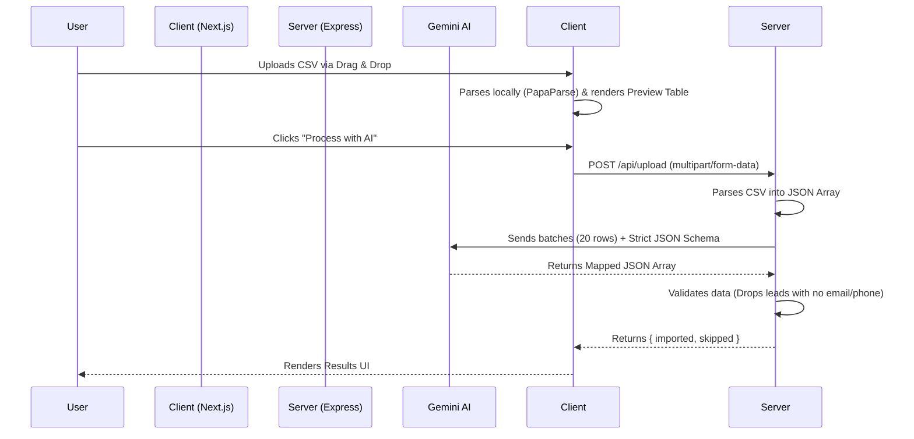

<div align="center">
  
# 🚀 GrowEasy AI-Powered CSV Importer

**An intelligent, full-stack CRM data ingestion pipeline built to map messy, unstructured CSV exports into a strict, standardized CRM schema using Google's Gemini AI.**

[](https://groweasy-hfzn.vercel.app/)
[](https://nextjs.org/)
[](https://nodejs.org/)
[](https://deepmind.google/technologies/gemini/)

</div>

---

## 📖 Overview

Uploading external lead data (from Facebook Ads, Google Ads, or custom Excel sheets) into a CRM is historically a painful process requiring manual column mapping. 

This application solves that problem by using **Large Language Models (LLMs)** to automatically interpret, clean, and map custom CSV columns into a strict CRM schema, completely removing the need for manual user mapping.

### ✨ Key Features
- **Zero-Config Uploads:** Users simply drag & drop *any* CSV file. No manual column mapping required.
- **Intelligent LLM Extraction:** Uses Google's `gemini-2.5-flash` to contextually understand headers and row data.
- **Graceful Error Handling:** Automatically skips records missing critical identifiers (e.g., missing *both* Email and Mobile Number).
- **Premium UI/UX:** Glassmorphic UI, micro-animations, and a responsive data table for previewing and reviewing AI results.

---

## 🏗 Architecture & Workflow

The system is separated into a Next.js client and a Node.js/Express backend to ensure scalable file handling and secure AI API interactions.



---

## 🔌 API Documentation

### `POST /api/upload`
Accepts a raw CSV file, processes the data through the AI extraction engine, and returns the strictly mapped CRM records.

**Headers:**
- `Content-Type: multipart/form-data`

**Request Body:**
| Field | Type | Description |
|-------|------|-------------|
| `file` | `File` | The raw CSV file to be processed. |

**Success Response (200 OK):**
```json
{
  "success": true,
  "total_imported": 4,
  "total_skipped": 1,
  "imported": [
    {
      "name": "Sarah Johnson",
      "email": "sarah.johnson@gmail.com",
      "country_code": "+91",
      "mobile_without_country_code": "9876543211",
      "company": "Tech Solutions",
      "city": "Bangalore",
      "crm_status": "GOOD_LEAD_FOLLOW_UP",
      "data_source": "leads_on_demand"
    }
  ],
  "skipped": [
    {
      "Lead Name": "Unknown User",
      "Remarks": "Missing contact info"
    }
  ]
}
```

---

## 🧠 AI Implementation Details

This project leverages the official `@google/genai` SDK. To prevent hallucination and ensure 100% reliable system ingestion, the AI is constrained using a **Strict Response Schema**.

1. **Batching:** The server chunks the CSV data into batches of 20 rows. This optimizes context limits and ensures the LLM does not lose track of data formatting.
2. **Deterministic Output:** The model is invoked with a `temperature` of `0.1` and a `responseSchema` defining the exact data types and enumerations expected by the CRM.
3. **Smart Consolidation:** Through precise System Instructions, the AI is trained to extract primary contact methods into their dedicated fields, while gracefully moving secondary numbers or random unstructured notes into a `crm_note` string.

---

## 💻 Local Setup & Development

### Prerequisites
- Node.js (v18+)
- Google Gemini API Key

### Installation

1. **Clone the repository:**
   ```bash
   git clone <your-repo-url>
   cd Groweasy
   ```

2. **Install all dependencies:**
   *(Monorepo setup: dependencies install concurrently)*
   ```bash
   npm install
   cd client && npm install
   cd ../server && npm install
   ```

3. **Configure Environment Variables:**
   Create a `.env` file inside the `server/` directory:
   ```env
   PORT=5000
   GEMINI_API_KEY=your_gemini_api_key_here
   ```

4. **Run the Application:**
   From the root folder (`Groweasy`), run:
   ```bash
   npm run dev
   ```
   *Frontend starts on `http://localhost:3000` | Backend starts on `http://localhost:5000`*

---

## ☁️ Deployment Notes

This repository is optimized for serverless environments.
- **Frontend:** Hosted on Vercel. 
- **Backend:** Configured for Vercel Serverless Functions / Render. The file upload engine (`multer`) is explicitly routed to the OS `/tmp` directory to comply with read-only serverless filesystem constraints.

---
*Developed for the GrowEasy Engineering Assignment.*
